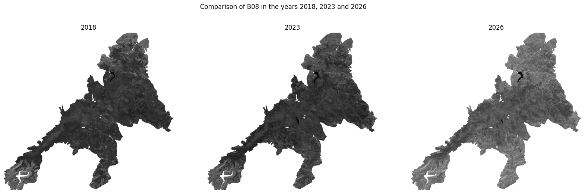
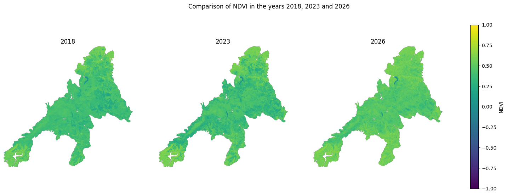
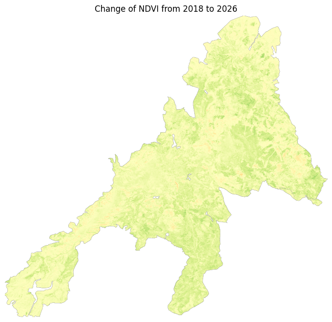
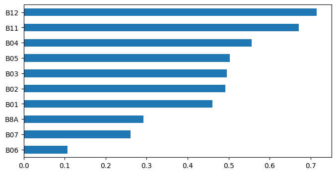
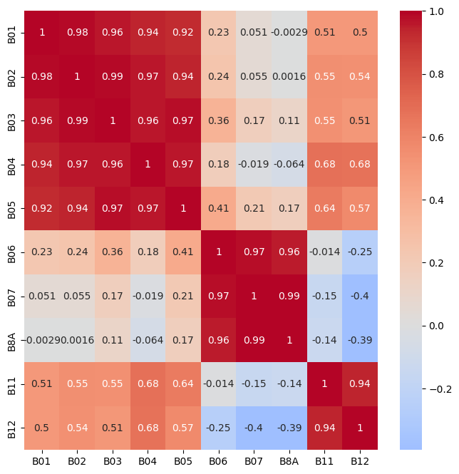
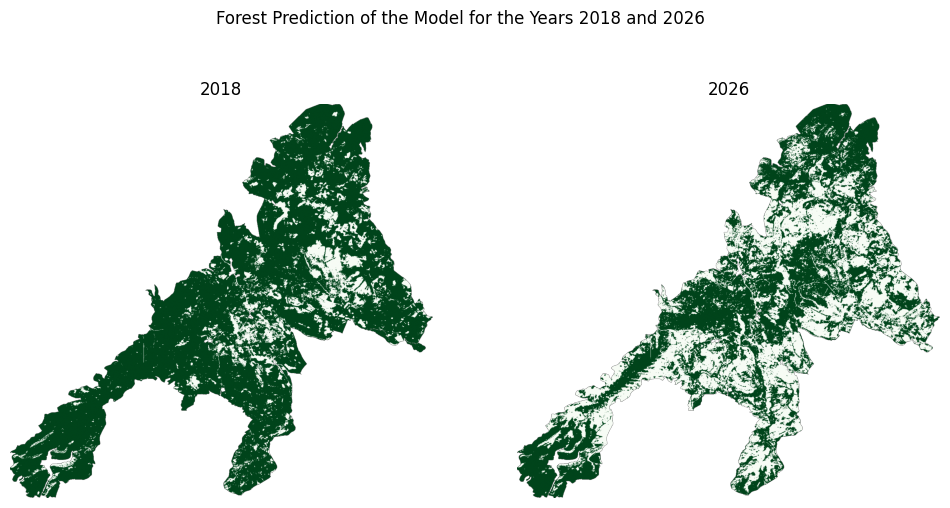
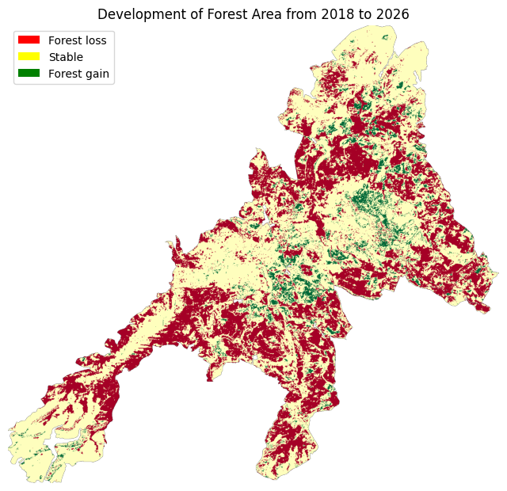
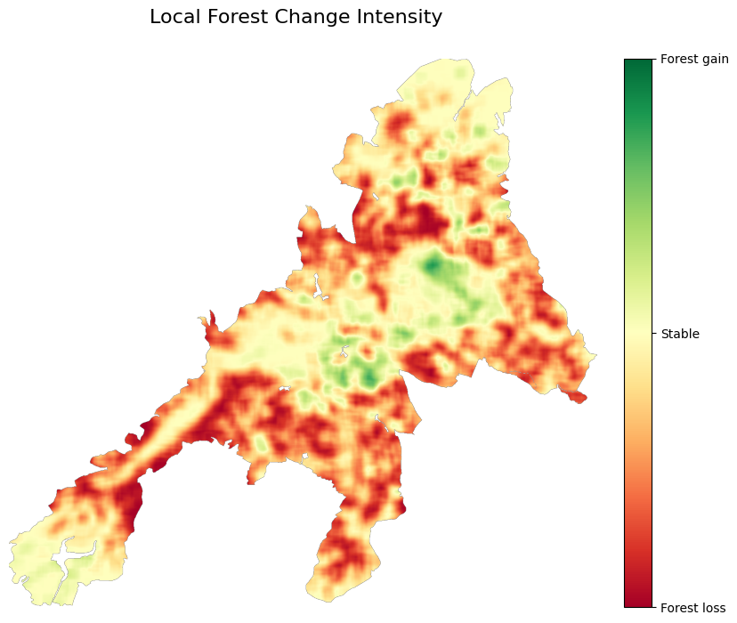

# Forest Change Analysis

Analysis of forest change in the Harz region using Sentinel-2 satellite data.

## Overview

This project investigates changes in forest cover in the Harz National Park between
2018 and 2026 using Sentinel-2 satellite data.

The main goal is to classify the area into forest and non-forest area and then use
that data to analyse changes in forest cover over time.

## Workflow

1. Sentinel-2 image acquisition
2. Image preprocessing
3. Data exploration
4. NDVI calculation
5. Data classification in forest / non-forest
6. Training model on that data
7. Use that model to the National Park
8. Visualisation of classified area
9. Comparing 2018 and 2026
10. Calculation and visualisation of the change from 2018 to 2026

## Study Area

Harz region, Germany.

## Years

- 2018
- 2023
- 2026

## Results

### Data Exploration

First the data had to be preprocessed, as none of the Sentinel-2-images cover the entire area of the Harz National Park, so two images were merged and the park area selected. As a first small test to see if the data was in a good shape to work with, the Near-Infrared (NIR) data of the 3 years was plotted.

As everything seems quite good as a next step, the so-called NDVI (Normalized Difference Vegetation Index) was calculated from this Near-Infrared data and Red light data. 

Furthermore, the change of the NDVI from 2018 to 2026 was calculated.

However, this NDVI index is not sufficient to evaluate the change of the forest area, as the NDVI is highly reactive to all kinds of plants, and by that would also measure the change of grass area and all other kinds of plants that are not forest.
So to achieve that, the area of the National Park had to be somehow classified as forest and non-forest area.

### Machine Learning

To distinguish between forest and non-forest area, a machine learning using supervised learning first needs some training data, so a couple of areas that could be clearly identified as forest or non-forest (like meadow, water or houses) were labeled. To achieve an overview of how good the different Sentinel-2 spectral bands might be in identifying forest area, the correlation of the different features with each other and the target was measured and plotted and showed very promising results, as multiple features correlated strongly with the target while not correlating perfectly with eachother.

Then a Random Forest (which has nothing to do with the actual forest) was optimized via cross-validation on the training data and finally classified about 99.9% of the data correctly, so the model could be used on the classification of the actual data.

### Forest Classification and Forest Change

As a first test, the model was used to classify the forest area in both years, 2018 and 2026.

As this seemed a very reasonable result when compared to the actual image, the model appears to be quite good in classifying the forest area even in this to the model unknown area.
So as a last step the change over those 8 years was calculated.

Because this image is quite good in showing every small change of forest in the area but seems quite disturbing as a very last step, the intensity of forest change was calculated.

This image proves very well what the last 8 years of drought and the rapid proliferation of the bark beetle did to the Harz National Park. Even though a lot of effort was put into reforestation, recurring drought periods and other natural catastrophes caused a large amount of its forest area to be lost. The model predicts a loss of about a third of the National Park's forest area.